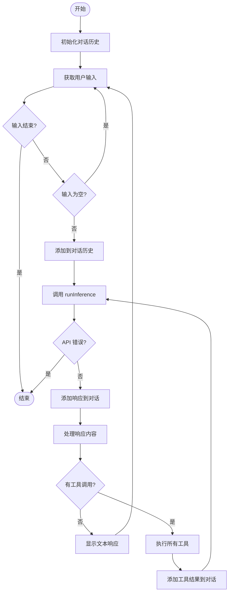

# Agent 设计

## 简介

Agent 是本项目的核心组件，负责管理与 Claude AI 的交互循环。它采用事件驱动的设计模式，协调用户输入、API 调用和工具执行。本文档详细说明 Agent 的设计思想、核心结构和实现细节。

## 设计模式

### 事件驱动架构

Agent 采用事件驱动架构，主要处理三类事件：

1. **用户输入事件**：用户通过标准输入发送消息
2. **API 响应事件**：Claude API 返回响应（文本或工具调用请求）
3. **工具执行事件**：工具执行完成并返回结果

这种设计使得 Agent 能够：
- 异步处理多个工具调用
- 保持清晰的控制流
- 易于扩展和维护

### 职责分离

Agent 遵循单一职责原则，专注于：
- **对话管理**：维护对话历史，确保上下文连贯
- **流程协调**：协调用户、API 和工具之间的交互
- **错误处理**：统一处理各类错误情况

Agent **不负责**：
- 工具的具体实现（由各工具函数负责）
- 用户界面渲染（由 main 函数负责）
- API 客户端管理（由 Anthropic SDK 负责）

## Agent 结构体

### 核心字段

```go
type Agent struct {
    client         *anthropic.Client           // Claude API 客户端
    getUserMessage func() (string, bool)       // 获取用户输入的函数
    tools          []ToolDefinition            // 可用工具列表
    verbose        bool                        // 是否启用详细日志
}
```

### 字段说明

#### client
- **类型**：`*anthropic.Client`
- **用途**：与 Claude API 通信的客户端实例
- **初始化**：由 `anthropic.NewClient()` 创建，自动从环境变量读取 API 密钥
- **生命周期**：在 Agent 的整个生命周期中保持不变

#### getUserMessage
- **类型**：`func() (string, bool)`
- **用途**：获取用户输入的回调函数
- **返回值**：
  - `string`：用户输入的消息
  - `bool`：是否成功获取输入（false 表示输入结束，如 EOF）
- **设计理由**：通过依赖注入，使 Agent 可以在不同环境中使用（交互式、批处理、测试等）

#### tools
- **类型**：`[]ToolDefinition`
- **用途**：存储所有可用工具的定义
- **特点**：
  - 在 Agent 创建时初始化
  - 运行时不可变
  - 支持动态查找和执行

#### verbose
- **类型**：`bool`
- **用途**：控制是否输出详细的调试日志
- **影响**：
  - `true`：输出详细的执行流程、API 调用、工具执行等信息
  - `false`：只输出必要的用户交互信息

## 核心方法

### NewAgent 构造函数

```go
func NewAgent(
    client *anthropic.Client,
    getUserMessage func() (string, bool),
    tools []ToolDefinition,
    verbose bool,
) *Agent {
    return &Agent{
        client:         client,
        getUserMessage: getUserMessage,
        tools:          tools,
        verbose:        verbose,
    }
}
```

**设计特点**：
- 简单的构造函数，无复杂初始化逻辑
- 所有依赖通过参数传入（依赖注入）
- 返回指针类型，避免大结构体拷贝

### Run 方法：主事件循环

`Run` 方法是 Agent 的核心，实现主事件循环。

```go
func (a *Agent) Run(ctx context.Context) error
```

**职责**：
1. 初始化对话历史
2. 循环接收用户输入
3. 调用 `runInference` 获取 Claude 响应
4. 处理工具调用请求
5. 显示最终响应

**流程图**：




**关键实现细节**：

#### 1. 对话历史管理

```go
conversation := []anthropic.MessageParam{}
```

- 使用切片存储所有消息
- 每次 API 调用都发送完整历史
- 包含用户消息、助手响应和工具结果

#### 2. 用户输入处理

```go
userInput, ok := a.getUserMessage()
if !ok {
    break  // 输入结束，退出循环
}

if userInput == "" {
    continue  // 跳过空消息
}
```

- 检查输入是否结束（EOF）
- 过滤空消息，避免无效 API 调用

#### 3. 工具调用循环

```go
for {
    // 处理响应内容
    var toolResults []anthropic.ContentBlockParamUnion
    var hasToolUse bool
    
    for _, content := range message.Content {
        if content.Type == "tool_use" {
            hasToolUse = true
            // 执行工具并收集结果
        }
    }
    
    if !hasToolUse {
        break  // 没有工具调用，退出内层循环
    }
    
    // 发送工具结果，继续推理
    message, err = a.runInference(ctx, conversation)
}
```

**设计要点**：
- 内层循环处理工具调用
- 批量收集所有工具调用结果
- 一次性发送所有结果给 Claude
- 继续推理直到不再需要工具

#### 4. 工具查找和执行

```go
for _, tool := range a.tools {
    if tool.Name == toolUse.Name {
        toolResult, toolError = tool.Function(toolUse.Input)
        toolFound = true
        break
    }
}

if !toolFound {
    toolError = fmt.Errorf("tool '%s' not found", toolUse.Name)
}
```

- 线性查找工具（工具数量少，性能足够）
- 处理工具未找到的情况
- 捕获工具执行错误

### runInference 方法：API 调用

`runInference` 方法封装了与 Claude API 的交互。

```go
func (a *Agent) runInference(
    ctx context.Context, 
    conversation []anthropic.MessageParam,
) (*anthropic.Message, error)
```

**职责**：
1. 将工具定义转换为 API 格式
2. 构造 API 请求参数
3. 调用 Claude API
4. 返回响应或错误

**实现细节**：

#### 1. 工具定义转换

```go
anthropicTools := []anthropic.ToolUnionParam{}
for _, tool := range a.tools {
    anthropicTools = append(anthropicTools, anthropic.ToolUnionParam{
        OfTool: &anthropic.ToolParam{
            Name:        tool.Name,
            Description: anthropic.String(tool.Description),
            InputSchema: tool.InputSchema,
        },
    })
}
```

- 将内部 `ToolDefinition` 转换为 Anthropic SDK 格式
- 每次调用都重新构造（保持无状态）

#### 2. API 请求构造

```go
message, err := a.client.Messages.New(ctx, anthropic.MessageNewParams{
    Model:     anthropic.ModelClaude3_7SonnetLatest,
    MaxTokens: int64(1024),
    Messages:  conversation,
    Tools:     anthropicTools,
})
```

**参数说明**：
- `Model`：使用的 Claude 模型版本
- `MaxTokens`：限制响应长度，控制成本
- `Messages`：完整的对话历史
- `Tools`：可用工具列表

## 会话管理

### 对话历史结构

对话历史是一个 `MessageParam` 切片，包含三种消息类型：

```go
type MessageParam struct {
    Role    string                      // "user" 或 "assistant"
    Content []ContentBlockParamUnion    // 内容块列表
}
```

### 消息类型

#### 1. 用户文本消息

```go
userMessage := anthropic.NewUserMessage(
    anthropic.NewTextBlock(userInput)
)
conversation = append(conversation, userMessage)
```

#### 2. 助手响应消息

```go
conversation = append(conversation, message.ToParam())
```

- 包含文本响应和/或工具调用请求

#### 3. 工具结果消息

```go
toolResultMessage := anthropic.NewUserMessage(toolResults...)
conversation = append(conversation, toolResultMessage)
```

- 角色为 "user"（从 API 角度看，工具结果是用户提供的）
- 包含一个或多个工具执行结果

### 对话历史示例

```
[
  {role: "user", content: [{type: "text", text: "读取 README.md"}]},
  {role: "assistant", content: [{type: "tool_use", name: "read_file", ...}]},
  {role: "user", content: [{type: "tool_result", tool_use_id: "...", content: "..."}]},
  {role: "assistant", content: [{type: "text", text: "文件内容是..."}]}
]
```

## 上下文维护

### 上下文累积

- 每次交互都会增加对话历史
- 历史越长，API 调用成本越高
- 历史越长，响应时间越慢

### 上下文限制

当前实现**没有**上下文管理策略，可能导致：
- Token 超出限制
- 成本过高
- 响应变慢

**改进方向**：
- 实现滑动窗口，只保留最近 N 条消息
- 实现消息摘要，压缩历史信息
- 实现上下文优先级，保留重要消息

## 错误处理

### API 错误

```go
message, err := a.runInference(ctx, conversation)
if err != nil {
    return err  // 直接返回，终止会话
}
```

**错误类型**：
- 网络错误
- API 密钥无效
- 速率限制
- Token 超限

**处理策略**：
- 当前：直接返回错误，终止程序
- 改进：可以实现重试机制、降级策略

### 工具执行错误

```go
if toolError != nil {
    toolResults = append(toolResults, 
        anthropic.NewToolResultBlock(toolUse.ID, toolError.Error(), true)
    )
}
```

**处理策略**：
- 将错误信息返回给 Claude
- 标记为错误结果（`isError: true`）
- Claude 可以根据错误信息调整策略

### 工具未找到错误

```go
if !toolFound {
    toolError = fmt.Errorf("tool '%s' not found", toolUse.Name)
}
```

**原因**：
- Claude 请求了不存在的工具
- 工具名称拼写错误
- 工具定义与实际不匹配

## 日志记录

### Verbose 模式

```go
if a.verbose {
    log.Printf("User input received: %q", userInput)
}
```

**记录内容**：
- 用户输入
- API 调用
- 工具执行
- 错误信息
- 执行时间

**输出位置**：
- `verbose=true`：输出到 stderr
- `verbose=false`：不输出调试日志

### 日志级别

当前实现只有两个级别：
- 详细模式（verbose）：所有调试信息
- 正常模式：只有用户交互

**改进方向**：
- 实现多级日志（DEBUG、INFO、WARN、ERROR）
- 支持日志文件输出
- 结构化日志（JSON 格式）


## 演进历程

### 第一步：基础聊天（chat.go）

最简单的 Agent 实现，只支持文本对话：

```go
type Agent struct {
    client         *anthropic.Client
    getUserMessage func() (string, bool)
    verbose        bool
}
```

**特点**：
- 无工具支持
- 简单的请求-响应循环
- 只处理文本消息

### 第二步：添加工具（read.go）

引入工具系统：

```go
type Agent struct {
    client         *anthropic.Client
    getUserMessage func() (string, bool)
    tools          []ToolDefinition  // 新增
    verbose        bool
}
```

**变化**：
- 添加 `tools` 字段
- 实现工具调用循环
- 处理工具结果

### 后续步骤

从 `list_files.go` 到 `code_search_tool.go`，Agent 结构保持不变，只是添加更多工具。这体现了良好的设计：
- **开闭原则**：对扩展开放，对修改封闭
- **稳定的核心**：Agent 逻辑无需改变
- **灵活的外围**：工具可以自由添加

## 设计优势

### 1. 简单性

- 核心逻辑清晰，易于理解
- 无复杂的状态管理
- 代码量少，维护成本低

### 2. 可测试性

- 依赖注入使得单元测试容易
- `getUserMessage` 可以用测试数据替换
- 工具可以独立测试

### 3. 可扩展性

- 添加新工具无需修改 Agent
- 可以轻松替换 API 客户端
- 支持不同的输入/输出方式

### 4. 可维护性

- 职责清晰，修改影响范围小
- 错误处理集中
- 日志记录统一

## 设计权衡

### 优点

✅ 简单直观，易于学习  
✅ 代码量少，维护成本低  
✅ 扩展性好，添加工具容易  
✅ 适合教学和原型开发  

### 缺点

❌ 无上下文管理，长对话可能超限  
❌ 无并发控制，工具串行执行  
❌ 无重试机制，网络错误直接失败  
❌ 无状态持久化，重启丢失历史  

### 适用场景

**适合**：
- 学习 AI Agent 开发
- 快速原型验证
- 短对话场景
- 单用户使用

**不适合**：
- 生产环境部署
- 长时间运行
- 多用户并发
- 需要高可用性

## 实际应用示例

### 示例 1：文件分析

```
用户: 读取 README.md 并总结主要内容
Agent: [调用 read_file 工具]
Agent: 这个项目是一个 AI 编程助手工作坊...
```

**流程**：
1. 用户消息添加到对话
2. Claude 决定调用 `read_file`
3. Agent 执行工具，获取文件内容
4. 工具结果返回给 Claude
5. Claude 分析内容并生成总结

### 示例 2：代码搜索和修改

```
用户: 找到所有 TODO 注释并创建任务列表
Agent: [调用 code_search 工具搜索 "TODO"]
Agent: [调用 edit_file 工具创建 tasks.md]
Agent: 已创建任务列表，包含 5 个待办事项
```

**流程**：
1. Claude 调用 `code_search` 查找 TODO
2. Agent 执行搜索，返回结果
3. Claude 分析结果，决定创建文件
4. Claude 调用 `edit_file` 创建任务列表
5. Agent 执行文件创建
6. Claude 确认完成

## 最佳实践

### 1. 合理设置 MaxTokens

```go
MaxTokens: int64(1024)  // 适合短响应
MaxTokens: int64(4096)  // 适合长响应
```

- 根据使用场景调整
- 平衡响应质量和成本

### 2. 使用 Context 控制超时

```go
ctx, cancel := context.WithTimeout(context.Background(), 30*time.Second)
defer cancel()
agent.Run(ctx)
```

- 避免长时间等待
- 及时释放资源

### 3. 实现优雅退出

```go
// 捕获中断信号
sigChan := make(chan os.Signal, 1)
signal.Notify(sigChan, os.Interrupt)

go func() {
    <-sigChan
    cancel()  // 取消 context
}()
```

### 4. 记录关键操作

```go
if a.verbose {
    log.Printf("Tool execution: %s, duration: %v", toolName, duration)
}
```

- 便于调试和性能分析
- 记录异常情况

## 常见问题

### Q: 为什么工具结果的角色是 "user"？

A: 从 Claude API 的角度看，工具执行是在外部环境中进行的，结果是作为用户提供的信息返回给模型。这符合 API 的消息格式要求。

### Q: 如何限制对话历史长度？

A: 当前实现没有限制。可以实现滑动窗口：

```go
const maxHistoryLength = 20
if len(conversation) > maxHistoryLength {
    conversation = conversation[len(conversation)-maxHistoryLength:]
}
```

### Q: 能否并发执行多个工具？

A: 当前是串行执行。可以改为并发：

```go
var wg sync.WaitGroup
for _, toolUse := range toolUses {
    wg.Add(1)
    go func(tu ToolUse) {
        defer wg.Done()
        // 执行工具
    }(toolUse)
}
wg.Wait()
```

### Q: 如何处理工具执行超时？

A: 在工具函数中使用 context：

```go
func ReadFile(ctx context.Context, input json.RawMessage) (string, error) {
    select {
    case <-ctx.Done():
        return "", ctx.Err()
    default:
        // 执行读取
    }
}
```

## 下一步

- 了解 [工具系统](./tool-system.md) 的实现细节
- 学习 [事件循环](./event-loop.md) 的完整流程
- 查看 [API 参考](../api-reference/agent.md) 了解详细接口
