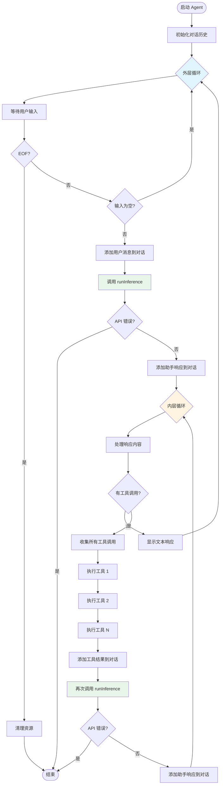
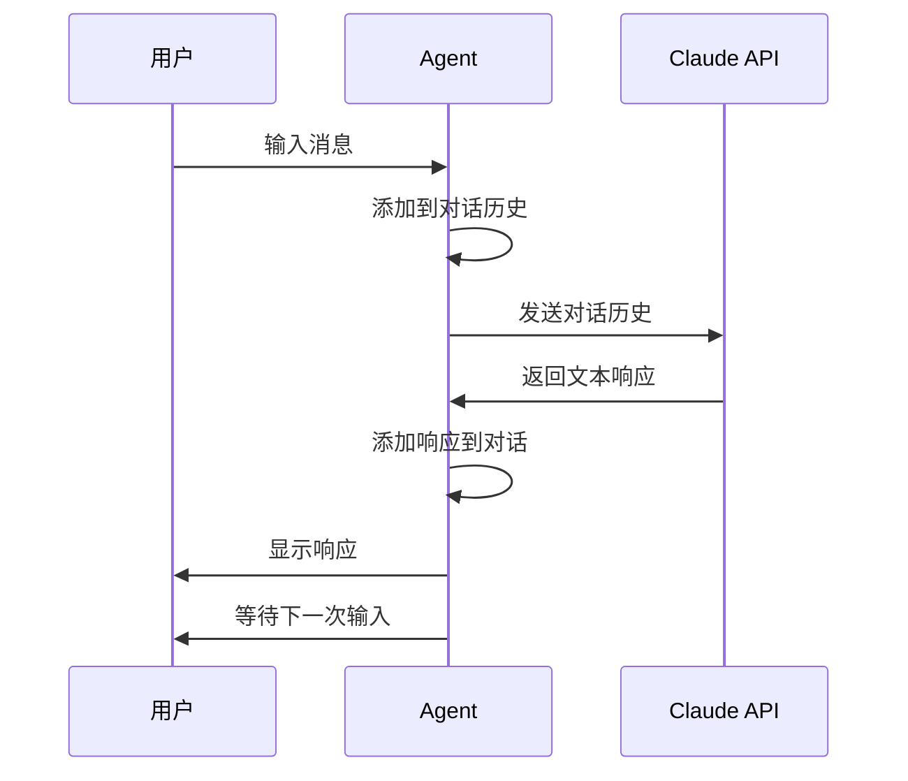
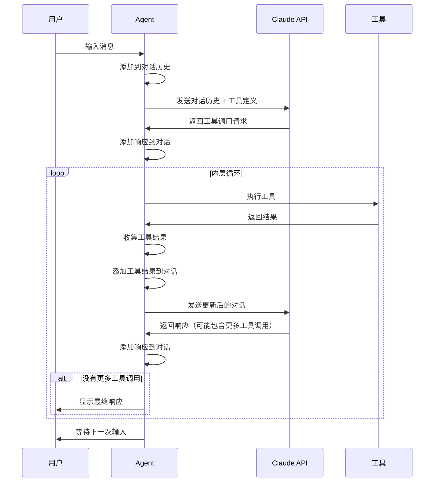
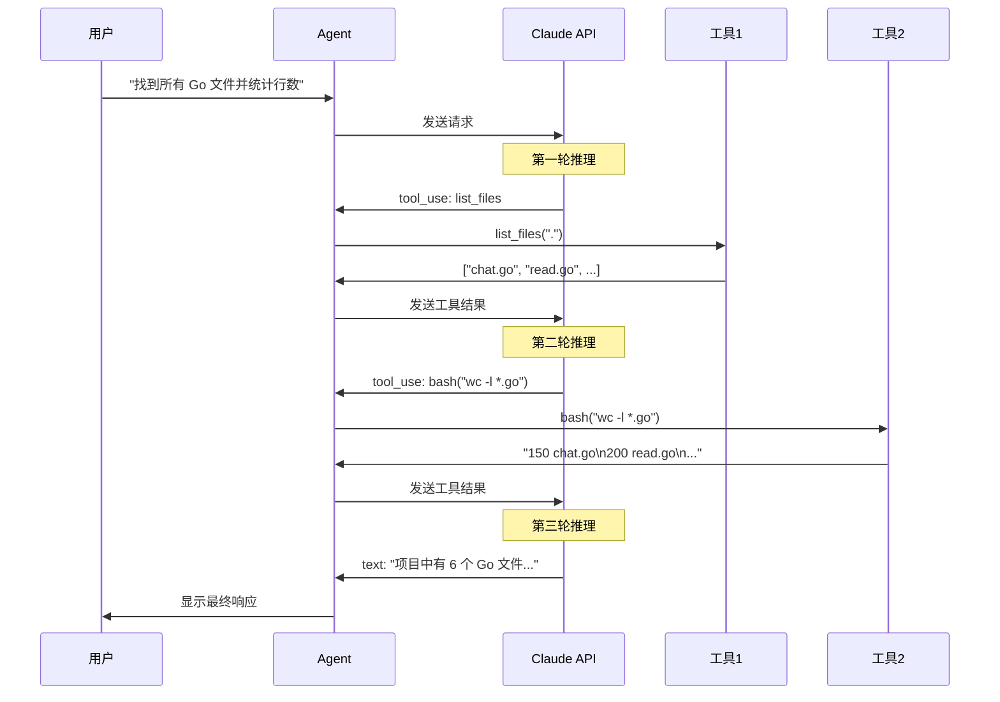

# 事件循环

## 简介

事件循环（Event Loop）是 Agent 的核心运行机制，负责协调用户输入、API 调用和工具执行。它采用循环结构，持续处理事件直到用户结束会话。本文档详细说明事件循环的工作机制、执行流程和各个阶段的处理逻辑。

## 事件循环概述

### 什么是事件循环？

事件循环是一个持续运行的循环，不断地：
1. 等待事件发生（用户输入、API 响应）
2. 处理事件
3. 产生新的事件（工具调用、API 请求）
4. 重复上述过程

### 为什么需要事件循环？

事件循环使得 Agent 能够：
- 🔄 持续与用户交互
- 🤖 处理 Claude 的异步响应
- 🔧 执行多个工具调用
- 📝 维护对话上下文

### 事件循环的层次

本项目有两层循环：

1. **外层循环**：处理用户输入
2. **内层循环**：处理工具调用

```go
for {  // 外层循环：用户交互
    // 获取用户输入
    // 调用 API
    
    for {  // 内层循环：工具处理
        // 检查工具调用
        // 执行工具
        // 继续推理
        if !hasToolUse {
            break  // 没有工具调用，退出内层循环
        }
    }
}
```

## 完整流程图



## 外层循环：用户交互

### 循环结构

```go
func (a *Agent) Run(ctx context.Context) error {
    conversation := []anthropic.MessageParam{}
    
    for {
        // 1. 获取用户输入
        // 2. 调用 API
        // 3. 处理响应（包含内层循环）
    }
    
    return nil
}
```

### 阶段 1：获取用户输入

```go
fmt.Print("\u001b[94mYou\u001b[0m: ")
userInput, ok := a.getUserMessage()
if !ok {
    break  // 用户结束输入（Ctrl+C 或 EOF）
}

if userInput == "" {
    continue  // 跳过空消息
}
```

**处理逻辑**：
- 显示提示符（蓝色 "You:"）
- 调用 `getUserMessage()` 获取输入
- 检查是否结束（`ok == false`）
- 过滤空消息

**用户输入来源**：
```go
scanner := bufio.NewScanner(os.Stdin)
getUserMessage := func() (string, bool) {
    if !scanner.Scan() {
        return "", false  // EOF 或错误
    }
    return scanner.Text(), true
}
```

### 阶段 2：构造用户消息

```go
userMessage := anthropic.NewUserMessage(
    anthropic.NewTextBlock(userInput)
)
conversation = append(conversation, userMessage)
```

**消息结构**：
```json
{
  "role": "user",
  "content": [
    {
      "type": "text",
      "text": "用户输入的内容"
    }
  ]
}
```

### 阶段 3：调用 API

```go
message, err := a.runInference(ctx, conversation)
if err != nil {
    return err  // API 错误，终止程序
}
conversation = append(conversation, message.ToParam())
```

**API 调用**：
- 发送完整对话历史
- 包含所有可用工具定义
- 等待 Claude 响应

**响应类型**：
- 纯文本响应
- 工具调用请求
- 文本 + 工具调用

### 阶段 4：进入内层循环

```go
for {
    // 处理工具调用
    // 如果没有工具调用，退出内层循环
}
```

## 内层循环：工具处理

### 循环结构

```go
for {
    var toolResults []anthropic.ContentBlockParamUnion
    var hasToolUse bool
    
    // 1. 检查并收集工具调用
    // 2. 执行所有工具
    // 3. 发送结果给 Claude
    // 4. 获取新响应
    
    if !hasToolUse {
        break  // 没有工具调用，退出
    }
}
```

### 阶段 1：处理响应内容

```go
for _, content := range message.Content {
    switch content.Type {
    case "text":
        fmt.Printf("\u001b[93mClaude\u001b[0m: %s\n", content.Text)
    case "tool_use":
        hasToolUse = true
        // 处理工具调用
    }
}
```

**内容类型**：
- `text`：Claude 的文本响应
- `tool_use`：工具调用请求

### 阶段 2：执行工具

```go
toolUse := content.AsToolUse()
fmt.Printf("\u001b[96mtool\u001b[0m: %s(%s)\n", 
    toolUse.Name, string(toolUse.Input))

// 查找并执行工具
for _, tool := range a.tools {
    if tool.Name == toolUse.Name {
        toolResult, toolError = tool.Function(toolUse.Input)
        fmt.Printf("\u001b[92mresult\u001b[0m: %s\n", toolResult)
        if toolError != nil {
            fmt.Printf("\u001b[91merror\u001b[0m: %s\n", toolError.Error())
        }
        toolFound = true
        break
    }
}
```

**执行流程**：
1. 解析工具调用信息
2. 显示工具名称和参数（青色）
3. 查找对应的工具定义
4. 执行工具函数
5. 显示结果（绿色）或错误（红色）

### 阶段 3：收集工具结果

```go
if toolError != nil {
    toolResults = append(toolResults, 
        anthropic.NewToolResultBlock(toolUse.ID, toolError.Error(), true)
    )
} else {
    toolResults = append(toolResults, 
        anthropic.NewToolResultBlock(toolUse.ID, toolResult, false)
    )
}
```

**结果格式**：
```json
{
  "type": "tool_result",
  "tool_use_id": "toolu_01...",
  "content": "工具执行结果",
  "is_error": false
}
```

### 阶段 4：发送结果并继续推理

```go
toolResultMessage := anthropic.NewUserMessage(toolResults...)
conversation = append(conversation, toolResultMessage)

message, err = a.runInference(ctx, conversation)
if err != nil {
    return err
}
conversation = append(conversation, message.ToParam())
```

**继续推理**：
- 将所有工具结果一次性发送
- Claude 根据结果继续推理
- 可能产生新的工具调用
- 或返回最终文本响应


## 时序图

### 单次交互（无工具调用）



### 单次交互（包含工具调用）



### 多工具调用场景



## 对话历史演进

### 示例：完整的对话历史

```go
conversation := []anthropic.MessageParam{
    // 第 1 轮：用户请求
    {
        Role: "user",
        Content: [{Type: "text", Text: "读取 README.md"}]
    },
    
    // 第 2 轮：Claude 请求工具
    {
        Role: "assistant",
        Content: [{
            Type: "tool_use",
            Name: "read_file",
            Input: {"path": "README.md"}
        }]
    },
    
    // 第 3 轮：工具结果
    {
        Role: "user",
        Content: [{
            Type: "tool_result",
            ToolUseId: "toolu_01...",
            Content: "# AI Programming Assistant\n..."
        }]
    },
    
    // 第 4 轮：Claude 最终响应
    {
        Role: "assistant",
        Content: [{
            Type: "text",
            Text: "这个项目是一个 AI 编程助手..."
        }]
    },
    
    // 第 5 轮：用户新请求
    {
        Role: "user",
        Content: [{Type: "text", Text: "列出所有 Go 文件"}]
    },
    
    // ... 继续
}
```

### 对话历史的增长

每次交互都会增加对话历史：

```
初始: []
用户输入后: [user_msg]
API 响应后: [user_msg, assistant_msg]
工具结果后: [user_msg, assistant_msg, tool_result_msg]
继续推理后: [user_msg, assistant_msg, tool_result_msg, assistant_msg]
下次输入后: [user_msg, assistant_msg, tool_result_msg, assistant_msg, user_msg]
...
```

**影响**：
- 历史越长，API 调用成本越高
- 历史越长，响应时间越慢
- 历史越长，上下文越完整

## 事件循环的关键特性

### 1. 阻塞式执行

```go
userInput, ok := a.getUserMessage()  // 阻塞，等待输入
```

- 等待用户输入时阻塞
- 等待 API 响应时阻塞
- 执行工具时阻塞

**优点**：
- 简单直观
- 易于理解和调试

**缺点**：
- 无法处理并发请求
- 长时间操作会阻塞整个程序

### 2. 同步工具执行

```go
for _, tool := range a.tools {
    if tool.Name == toolUse.Name {
        toolResult, toolError = tool.Function(toolUse.Input)
        break
    }
}
```

- 工具按顺序执行
- 一个工具完成后才执行下一个

**优点**：
- 避免竞态条件
- 结果顺序可预测

**缺点**：
- 无法利用并发加速
- 慢工具会拖慢整体速度

### 3. 批量工具结果

```go
var toolResults []anthropic.ContentBlockParamUnion

// 收集所有工具结果
for _, content := range message.Content {
    if content.Type == "tool_use" {
        // 执行工具并添加结果
        toolResults = append(toolResults, result)
    }
}

// 一次性发送所有结果
toolResultMessage := anthropic.NewUserMessage(toolResults...)
```

**优点**：
- 减少 API 调用次数
- Claude 可以综合考虑所有结果

**缺点**：
- 必须等待所有工具完成
- 无法流式返回结果

### 4. 错误即终止

```go
message, err := a.runInference(ctx, conversation)
if err != nil {
    return err  // 直接返回，终止程序
}
```

**当前行为**：
- API 错误导致程序终止
- 无重试机制
- 无降级策略

**改进方向**：
```go
const maxRetries = 3
for i := 0; i < maxRetries; i++ {
    message, err := a.runInference(ctx, conversation)
    if err == nil {
        break
    }
    if i == maxRetries-1 {
        return err
    }
    time.Sleep(time.Second * time.Duration(i+1))
}
```

## 事件循环的状态管理

### 循环变量

#### 外层循环

```go
conversation := []anthropic.MessageParam{}  // 对话历史
```

- 在整个会话中累积
- 每次循环都会增长
- 包含所有历史消息

#### 内层循环

```go
var toolResults []anthropic.ContentBlockParamUnion  // 工具结果
var hasToolUse bool  // 是否有工具调用
```

- 每次内层循环重置
- 只在当前轮次有效
- 用于控制循环退出

### 状态转换

```
[等待输入] -> [处理输入] -> [调用 API] -> [处理响应]
                                              |
                                              v
                                        [有工具调用?]
                                         /         \
                                       是           否
                                       |            |
                                  [执行工具]    [显示响应]
                                       |            |
                                  [继续推理]        |
                                       |            |
                                       +------------+
                                              |
                                              v
                                        [等待输入]
```

## 控制流分析

### 正常流程

```
1. 用户输入 "Hello"
2. 添加到对话历史
3. 调用 API
4. 收到文本响应 "Hi there!"
5. 显示响应
6. 回到步骤 1
```

### 工具调用流程

```
1. 用户输入 "读取 README.md"
2. 添加到对话历史
3. 调用 API
4. 收到工具调用请求 read_file
5. 执行 read_file 工具
6. 收集工具结果
7. 添加工具结果到对话
8. 再次调用 API
9. 收到文本响应
10. 显示响应
11. 回到步骤 1
```

### 多工具调用流程

```
1. 用户输入 "找到所有 TODO"
2. 添加到对话历史
3. 调用 API
4. 收到工具调用请求 code_search
5. 执行 code_search 工具
6. 收集工具结果
7. 添加工具结果到对话
8. 再次调用 API
9. 收到工具调用请求 edit_file
10. 执行 edit_file 工具
11. 收集工具结果
12. 添加工具结果到对话
13. 再次调用 API
14. 收到文本响应
15. 显示响应
16. 回到步骤 1
```

### 错误流程

```
1. 用户输入 "读取不存在的文件"
2. 添加到对话历史
3. 调用 API
4. 收到工具调用请求 read_file
5. 执行 read_file 工具 -> 返回错误
6. 收集工具结果（标记为错误）
7. 添加工具结果到对话
8. 再次调用 API
9. 收到文本响应（说明文件不存在）
10. 显示响应
11. 回到步骤 1
```

## 性能考虑

### API 调用次数

每次交互的 API 调用次数：
- 无工具调用：1 次
- 1 个工具调用：2 次（请求工具 + 处理结果）
- N 个工具调用：N+1 次

**优化策略**：
- 批量执行工具（当前已实现）
- 缓存常见查询结果
- 使用流式 API（如果支持）

### 对话历史大小

对话历史随时间增长：
- 每条用户消息：~100 tokens
- 每条助手响应：~200 tokens
- 每个工具调用：~50 tokens
- 每个工具结果：~500 tokens（取决于内容）

**10 轮对话**：约 8,500 tokens  
**50 轮对话**：约 42,500 tokens  
**100 轮对话**：约 85,000 tokens（接近限制）

### 工具执行时间

不同工具的执行时间：
- `read_file`：< 10ms（小文件）
- `list_files`：10-100ms（取决于目录大小）
- `bash`：100ms - 数秒（取决于命令）
- `code_search`：100-500ms（取决于代码库大小）
- `edit_file`：< 10ms

**总执行时间** = API 延迟 + 工具执行时间


## 事件循环的变体

### 基础版本（chat.go）

```go
for {
    userInput, ok := a.getUserMessage()
    if !ok { break }
    
    conversation = append(conversation, userMessage)
    message, err := a.runInference(ctx, conversation)
    if err != nil { return err }
    conversation = append(conversation, message.ToParam())
    
    // 只显示文本，无工具处理
    for _, content := range message.Content {
        if content.Type == "text" {
            fmt.Printf("Claude: %s\n", content.Text)
        }
    }
}
```

**特点**：
- 单层循环
- 无工具支持
- 简单的请求-响应模式

### 工具版本（read.go 及之后）

```go
for {  // 外层循环
    userInput, ok := a.getUserMessage()
    if !ok { break }
    
    conversation = append(conversation, userMessage)
    message, err := a.runInference(ctx, conversation)
    if err != nil { return err }
    conversation = append(conversation, message.ToParam())
    
    for {  // 内层循环
        var hasToolUse bool
        // 处理工具调用
        if !hasToolUse { break }
        
        // 执行工具并继续推理
        message, err = a.runInference(ctx, conversation)
        conversation = append(conversation, message.ToParam())
    }
}
```

**特点**：
- 双层循环
- 支持工具调用
- 自动处理多轮推理

## 事件循环的扩展

### 1. 添加超时控制

```go
func (a *Agent) Run(ctx context.Context) error {
    conversation := []anthropic.MessageParam{}
    
    for {
        select {
        case <-ctx.Done():
            return ctx.Err()  // 超时或取消
        default:
            // 正常处理
        }
        
        // ... 其余逻辑
    }
}
```

**使用方式**：
```go
ctx, cancel := context.WithTimeout(context.Background(), 5*time.Minute)
defer cancel()
agent.Run(ctx)
```

### 2. 添加并发工具执行

```go
// 并发执行所有工具
type toolExecution struct {
    id     string
    result string
    err    error
}

results := make(chan toolExecution, len(toolUses))

for _, toolUse := range toolUses {
    go func(tu ToolUse) {
        result, err := executeTool(tu)
        results <- toolExecution{tu.ID, result, err}
    }(toolUse)
}

// 收集结果
for i := 0; i < len(toolUses); i++ {
    exec := <-results
    toolResults = append(toolResults, createToolResult(exec))
}
```

### 3. 添加流式输出

```go
// 流式显示 Claude 的响应
for _, content := range message.Content {
    if content.Type == "text" {
        for _, char := range content.Text {
            fmt.Print(string(char))
            time.Sleep(10 * time.Millisecond)  // 模拟打字效果
        }
        fmt.Println()
    }
}
```

### 4. 添加历史管理

```go
const maxHistoryLength = 20

func trimHistory(conversation []anthropic.MessageParam) []anthropic.MessageParam {
    if len(conversation) <= maxHistoryLength {
        return conversation
    }
    
    // 保留最近的消息
    return conversation[len(conversation)-maxHistoryLength:]
}

// 在每次 API 调用前
conversation = trimHistory(conversation)
message, err := a.runInference(ctx, conversation)
```

### 5. 添加会话持久化

```go
func (a *Agent) saveConversation(conversation []anthropic.MessageParam) error {
    data, err := json.Marshal(conversation)
    if err != nil {
        return err
    }
    return os.WriteFile("conversation.json", data, 0644)
}

func (a *Agent) loadConversation() ([]anthropic.MessageParam, error) {
    data, err := os.ReadFile("conversation.json")
    if err != nil {
        return nil, err
    }
    var conversation []anthropic.MessageParam
    err = json.Unmarshal(data, &conversation)
    return conversation, err
}
```

## 调试事件循环

### 启用 Verbose 模式

```bash
go run code_search_tool.go --verbose
```

**输出示例**：
```
2024/12/02 10:30:15 Verbose logging enabled
2024/12/02 10:30:15 Anthropic client initialized
2024/12/02 10:30:15 Initialized 5 tools
2024/12/02 10:30:15 Starting chat session with tools enabled
You: 读取 README.md
2024/12/02 10:30:16 User input received: "读取 README.md"
2024/12/02 10:30:16 Sending message to Claude, conversation length: 1
2024/12/02 10:30:16 Making API call to Claude with model: claude-3-7-sonnet-20250219 and 5 tools
2024/12/02 10:30:17 API call successful, response received
2024/12/02 10:30:17 Processing 1 content blocks from Claude
2024/12/02 10:30:17 Tool use detected: read_file with input: {"path":"README.md"}
tool: read_file({"path":"README.md"})
2024/12/02 10:30:17 Executing tool: read_file
2024/12/02 10:30:17 Reading file: README.md
2024/12/02 10:30:17 Successfully read file README.md (1234 bytes)
result: # AI Programming Assistant Workshop...
2024/12/02 10:30:17 Tool execution successful, result length: 1234 chars
2024/12/02 10:30:17 Sending 1 tool results back to Claude
2024/12/02 10:30:18 Making API call to Claude with model: claude-3-7-sonnet-20250219 and 5 tools
2024/12/02 10:30:19 API call successful, response received
2024/12/02 10:30:19 Received followup response with 1 content blocks
2024/12/02 10:30:19 Processing 1 content blocks from Claude
Claude: 这个项目是一个 AI 编程助手工作坊...
```

### 添加自定义日志

```go
// 在关键位置添加日志
log.Printf("[LOOP] Starting outer loop iteration")
log.Printf("[INPUT] Received: %q", userInput)
log.Printf("[API] Calling with %d messages", len(conversation))
log.Printf("[TOOL] Executing %s", toolName)
log.Printf("[RESULT] Got %d bytes", len(result))
```

### 使用调试器

```bash
# 使用 delve 调试
dlv debug code_search_tool.go

# 设置断点
(dlv) break agent.go:45
(dlv) continue

# 查看变量
(dlv) print conversation
(dlv) print hasToolUse
```

## 常见问题

### Q: 为什么需要两层循环？

A: 外层循环处理用户交互，内层循环处理工具调用。Claude 可能需要多次工具调用才能完成任务，内层循环确保所有工具调用都被处理。

### Q: 工具调用会无限循环吗？

A: 理论上可能，但实际上：
- Claude 有内置的循环检测
- API 有 token 限制
- 可以添加最大迭代次数限制

### Q: 如何优雅地退出循环？

A: 当前实现：
- 用户按 Ctrl+C 或发送 EOF
- API 错误时自动退出

改进方案：
```go
// 捕获中断信号
sigChan := make(chan os.Signal, 1)
signal.Notify(sigChan, os.Interrupt)

go func() {
    <-sigChan
    fmt.Println("\nGracefully shutting down...")
    cancel()  // 取消 context
}()
```

### Q: 能否暂停和恢复会话？

A: 当前不支持。可以实现：
```go
// 保存会话
if userInput == "/save" {
    saveConversation(conversation)
    continue
}

// 加载会话
if userInput == "/load" {
    conversation, _ = loadConversation()
    continue
}
```

### Q: 如何限制工具调用次数？

A: 添加计数器：
```go
const maxToolCalls = 10
toolCallCount := 0

for {
    // ... 工具处理
    toolCallCount++
    if toolCallCount >= maxToolCalls {
        return fmt.Errorf("exceeded maximum tool calls")
    }
    
    if !hasToolUse { break }
}
```

## 最佳实践

### 1. 合理设置超时

```go
// 为整个会话设置超时
ctx, cancel := context.WithTimeout(context.Background(), 30*time.Minute)
defer cancel()

// 为单次 API 调用设置超时
apiCtx, apiCancel := context.WithTimeout(ctx, 30*time.Second)
defer apiCancel()
message, err := a.runInference(apiCtx, conversation)
```

### 2. 记录关键事件

```go
if a.verbose {
    log.Printf("[LOOP] Iteration %d, conversation length: %d", 
        iteration, len(conversation))
    log.Printf("[TOOL] Executed %d tools in this round", len(toolResults))
}
```

### 3. 处理长时间运行的工具

```go
func LongRunningTool(input json.RawMessage) (string, error) {
    // 显示进度
    fmt.Println("Processing... (this may take a while)")
    
    // 执行操作
    result := doLongOperation()
    
    return result, nil
}
```

### 4. 优雅处理错误

```go
message, err := a.runInference(ctx, conversation)
if err != nil {
    // 记录错误
    log.Printf("API error: %v", err)
    
    // 尝试恢复
    if isRetryable(err) {
        time.Sleep(time.Second)
        continue
    }
    
    // 无法恢复，退出
    return fmt.Errorf("fatal error: %w", err)
}
```

## 性能优化建议

### 1. 减少 API 调用

- 批量处理工具调用（已实现）
- 缓存常见查询结果
- 使用更高效的提示词

### 2. 优化工具执行

- 并发执行独立工具
- 为慢工具添加缓存
- 限制工具输出大小

### 3. 管理对话历史

- 实现滑动窗口
- 压缩旧消息
- 只保留关键信息

### 4. 改进用户体验

- 显示执行进度
- 流式输出响应
- 提供取消操作的方式

## 下一步

- 查看 [Agent 设计](./agent-design.md) 了解 Agent 的详细实现
- 学习 [工具系统](./tool-system.md) 了解工具的执行机制
- 参考 [API 文档](../api-reference/agent.md) 了解完整接口
