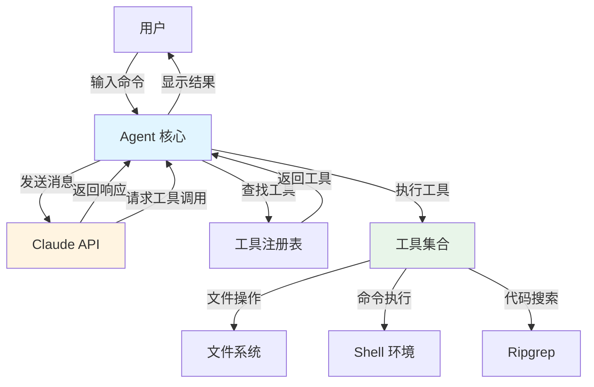
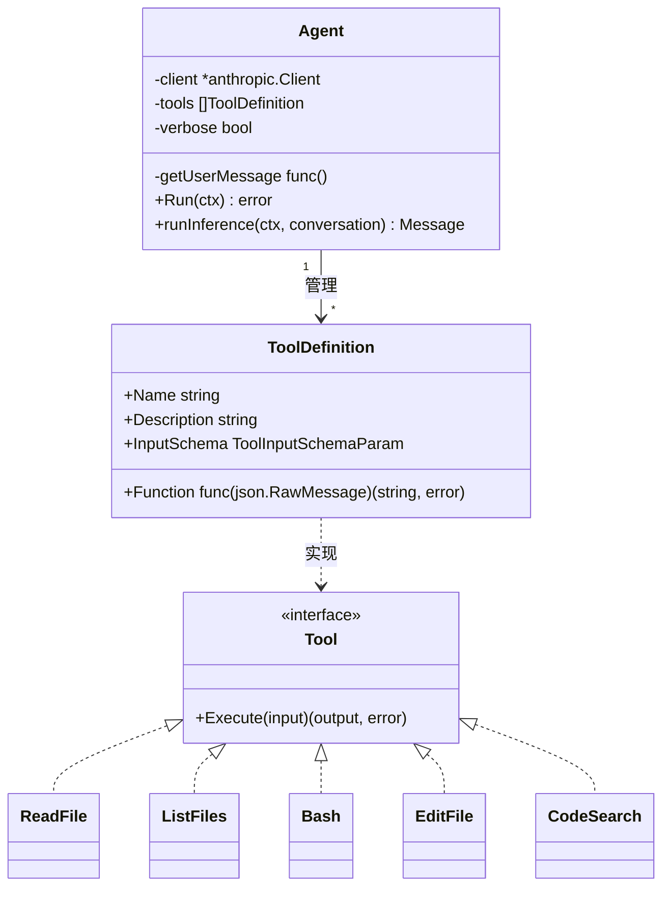
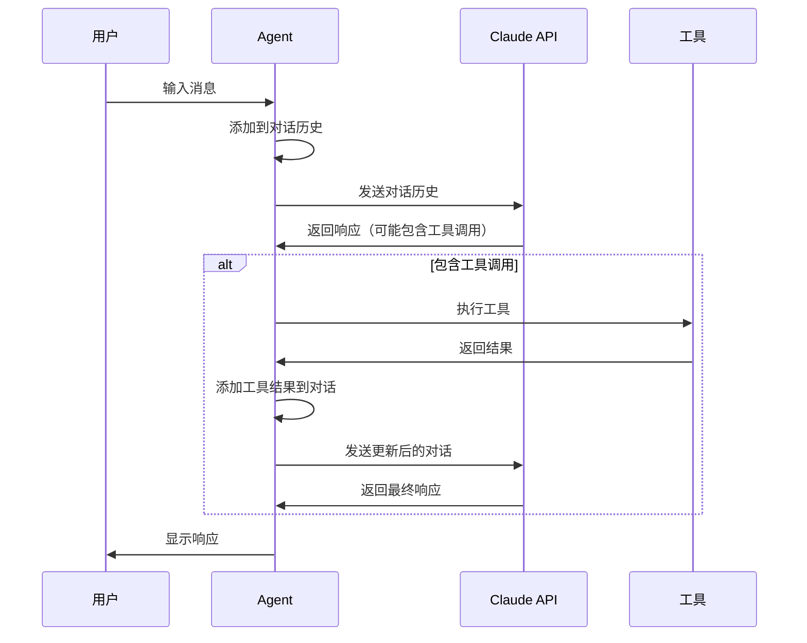

# 架构概览

## 简介

本文档介绍 AI 编程助手工作坊项目的整体架构设计。该项目采用简洁的事件驱动架构，通过 Agent 模式实现与 Claude AI 的交互，并通过可扩展的工具系统赋予 AI 操作文件系统和执行命令的能力。

## 设计理念

项目的核心设计理念包括：

1. **渐进式学习**：从最简单的聊天功能开始，逐步添加工具能力，每个步骤都是可独立运行的完整程序
2. **清晰的职责分离**：Agent 负责对话管理，工具负责具体功能，两者通过标准接口交互
3. **可扩展性**：新工具可以轻松添加到系统中，无需修改核心 Agent 逻辑
4. **简单性优先**：避免过度设计，使用 Go 语言的标准库和简单的数据结构

## 系统架构图



## 核心组件

### 1. Agent（代理）

Agent 是系统的核心组件，负责：
- 管理与用户的交互循环
- 维护对话历史（conversation）
- 调用 Claude API 进行推理
- 处理工具调用请求
- 协调工具执行和结果返回

**关键特性**：
- 单一职责：专注于对话流程管理
- 无状态工具执行：每次工具调用都是独立的
- 错误处理：优雅地处理 API 错误和工具执行失败

### 2. 工具系统（Tool System）

工具系统为 Claude 提供与外部世界交互的能力。每个工具包含：
- **名称**：工具的唯一标识符
- **描述**：告诉 Claude 何时使用该工具
- **输入 Schema**：定义工具接受的参数
- **执行函数**：实际执行工具功能的代码

**内置工具**：
- `read_file`：读取文件内容
- `list_files`：列出目录中的文件
- `bash`：执行 Shell 命令
- `edit_file`：编辑文件内容
- `code_search`：使用 ripgrep 搜索代码

### 3. 事件循环（Event Loop）

事件循环是 Agent 的核心运行机制，处理以下流程：
1. 接收用户输入
2. 将输入添加到对话历史
3. 调用 Claude API 获取响应
4. 检查响应中是否包含工具调用
5. 如果有工具调用，执行工具并返回结果
6. 重复步骤 3-5 直到 Claude 不再请求工具
7. 显示最终响应给用户
8. 返回步骤 1

### 4. Schema 生成器

使用 Go 的泛型和反射机制，自动从结构体生成 JSON Schema，用于定义工具的输入参数。这确保了：
- 类型安全：编译时检查参数类型
- 自动文档：从代码注释生成参数描述
- 减少重复：无需手动编写 Schema

## 组件关系

### Agent 与工具的关系



### 数据流



## 技术栈

- **编程语言**：Go 1.21+
- **AI API**：Anthropic Claude API (claude-3-7-sonnet-latest)
- **依赖管理**：Go Modules
- **Schema 生成**：github.com/invopop/jsonschema
- **代码搜索**：ripgrep (外部工具)

## 扩展性设计

### 添加新工具

添加新工具只需三步：

1. **定义输入结构体**：
```go
type MyToolInput struct {
    Param string `json:"param" jsonschema_description:"参数描述"`
}
```

2. **实现工具函数**：
```go
func MyTool(input json.RawMessage) (string, error) {
    var params MyToolInput
    json.Unmarshal(input, &params)
    // 执行工具逻辑
    return result, nil
}
```

3. **注册工具**：
```go
var MyToolDefinition = ToolDefinition{
    Name:        "my_tool",
    Description: "工具描述",
    InputSchema: GenerateSchema[MyToolInput](),
    Function:    MyTool,
}

tools := []ToolDefinition{..., MyToolDefinition}
```

### 自定义 Agent 行为

Agent 的行为可以通过以下方式定制：
- 修改 `MaxTokens` 控制响应长度
- 更换 Claude 模型版本
- 添加系统提示词（System Prompt）
- 实现自定义的输入/输出处理

## 性能考虑

1. **API 调用**：每次推理都会调用 Claude API，网络延迟是主要瓶颈
2. **对话历史**：随着对话进行，历史消息会累积，影响 API 调用成本和响应时间
3. **工具执行**：某些工具（如 `bash`、`code_search`）可能耗时较长
4. **内存使用**：对话历史和文件内容都存储在内存中

## 安全考虑

1. **命令执行**：`bash` 工具可以执行任意命令，存在安全风险
2. **文件访问**：工具可以读写文件系统，需要注意权限控制
3. **API 密钥**：通过环境变量管理，避免硬编码
4. **输入验证**：工具函数应验证输入参数的有效性

## 下一步

- 深入了解 [Agent 设计](./agent-design.md)（即将推出）
- 学习 [工具系统](./tool-system.md)（即将推出）的实现细节
- 理解 [事件循环](./event-loop.md)（即将推出）的工作机制
