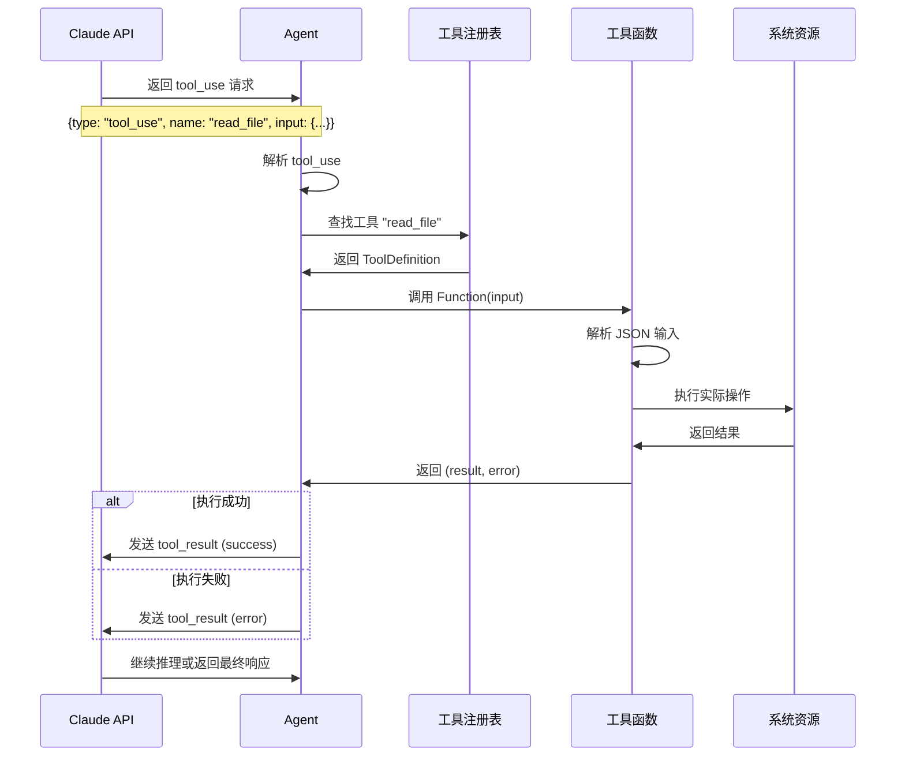

# 工具系统

## 简介

工具系统是本项目的核心特性之一，它赋予 Claude AI 与外部世界交互的能力。通过工具，Claude 可以读取文件、执行命令、搜索代码等。本文档详细说明工具的定义、注册、执行流程以及 Schema 生成机制。

## 工具系统概述

### 什么是工具？

工具（Tool）是一个可以被 Claude 调用的函数，用于执行特定任务。每个工具包含：

1. **名称**：唯一标识符，Claude 用它来请求工具
2. **描述**：告诉 Claude 工具的功能和使用场景
3. **输入 Schema**：定义工具接受的参数类型和格式
4. **执行函数**：实际执行工具功能的 Go 函数

### 工具的作用

工具让 Claude 能够：
- 📁 访问文件系统（读取、列出、编辑文件）
- 🔧 执行系统命令
- 🔍 搜索代码库
- 🌐 调用外部 API（可扩展）
- 💾 操作数据库（可扩展）

## ToolDefinition 结构

### 定义

```go
type ToolDefinition struct {
    Name        string                         // 工具名称
    Description string                         // 工具描述
    InputSchema anthropic.ToolInputSchemaParam // 输入参数 Schema
    Function    func(input json.RawMessage) (string, error) // 执行函数
}
```

### 字段详解

#### Name（名称）

```go
Name: "read_file"
```

**要求**：
- 使用小写字母和下划线
- 简洁且具有描述性
- 在所有工具中唯一

**示例**：
- ✅ `read_file`、`list_files`、`code_search`
- ❌ `ReadFile`、`read-file`、`rf`

#### Description（描述）

```go
Description: "Read the contents of a given relative file path. Use this when you want to see what's inside a file. Do not use this with directory names."
```

**要求**：
- 清晰说明工具的功能
- 提供使用场景指导
- 说明限制和注意事项

**最佳实践**：
- 使用祈使句（"Read..."、"Execute..."）
- 包含使用提示（"Use this when..."）
- 说明不适用场景（"Do not use..."）

#### InputSchema（输入 Schema）

```go
InputSchema: ReadFileInputSchema
```

**作用**：
- 定义工具接受的参数
- 提供参数类型和验证规则
- 生成 API 文档

**生成方式**：使用 `GenerateSchema` 函数自动生成

#### Function（执行函数）

```go
Function: ReadFile
```

**签名**：
```go
func(input json.RawMessage) (string, error)
```

**参数**：
- `input`：JSON 格式的输入参数

**返回值**：
- `string`：工具执行结果（文本格式）
- `error`：执行错误（如果有）

## 工具定义示例

### 完整示例：ReadFile 工具

```go
// 1. 定义输入结构体
type ReadFileInput struct {
    Path string `json:"path" jsonschema_description:"The relative path of a file in the working directory."`
}

// 2. 生成 Schema
var ReadFileInputSchema = GenerateSchema[ReadFileInput]()

// 3. 实现执行函数
func ReadFile(input json.RawMessage) (string, error) {
    // 解析输入
    readFileInput := ReadFileInput{}
    err := json.Unmarshal(input, &readFileInput)
    if err != nil {
        return "", err
    }

    // 执行功能
    log.Printf("Reading file: %s", readFileInput.Path)
    content, err := os.ReadFile(readFileInput.Path)
    if err != nil {
        log.Printf("Failed to read file %s: %v", readFileInput.Path, err)
        return "", err
    }
    
    log.Printf("Successfully read file %s (%d bytes)", readFileInput.Path, len(content))
    return string(content), nil
}

// 4. 创建工具定义
var ReadFileDefinition = ToolDefinition{
    Name:        "read_file",
    Description: "Read the contents of a given relative file path. Use this when you want to see what's inside a file. Do not use this with directory names.",
    InputSchema: ReadFileInputSchema,
    Function:    ReadFile,
}
```

## Schema 生成机制

### GenerateSchema 函数

```go
func GenerateSchema[T any]() anthropic.ToolInputSchemaParam {
    reflector := jsonschema.Reflector{
        AllowAdditionalProperties: false,
        DoNotReference:            true,
    }
    var v T
    schema := reflector.Reflect(v)
    
    return anthropic.ToolInputSchemaParam{
        Properties: schema.Properties,
    }
}
```

### 工作原理

1. **泛型参数**：接受任意类型 `T`
2. **反射**：使用 `jsonschema.Reflector` 分析类型结构
3. **生成 Schema**：创建 JSON Schema 定义
4. **转换格式**：转换为 Anthropic API 所需格式

### 结构体标签

#### json 标签

```go
Path string `json:"path"`
```

- 定义 JSON 字段名
- 支持 `omitempty` 选项（可选字段）

#### jsonschema_description 标签

```go
Path string `jsonschema_description:"The relative path of a file in the working directory."`
```

- 提供字段描述
- Claude 使用这些描述理解参数用途

### Schema 示例

生成的 Schema 结构：

```json
{
  "properties": {
    "path": {
      "type": "string",
      "description": "The relative path of a file in the working directory."
    }
  },
  "required": ["path"]
}
```


## 工具注册流程

### 1. 创建工具列表

```go
tools := []ToolDefinition{
    ReadFileDefinition,
    ListFilesDefinition,
    BashDefinition,
    EditFileDefinition,
    CodeSearchDefinition,
}
```

**特点**：
- 简单的切片
- 编译时确定
- 顺序不重要

### 2. 传递给 Agent

```go
agent := NewAgent(&client, getUserMessage, tools, *verbose)
```

**时机**：
- Agent 创建时注册
- 运行时不可变

### 3. Agent 存储工具

```go
type Agent struct {
    tools []ToolDefinition
    // ...
}
```

**访问方式**：
- 线性查找（工具数量少）
- 按名称匹配

## 工具执行流程

### 完整流程图



### 详细步骤

#### 步骤 1：Claude 请求工具

Claude 在响应中包含 `tool_use` 内容块：

```go
content := message.Content[i]
if content.Type == "tool_use" {
    toolUse := content.AsToolUse()
    // toolUse.Name: "read_file"
    // toolUse.Input: {"path": "README.md"}
    // toolUse.ID: "toolu_01..."
}
```

#### 步骤 2：Agent 查找工具

```go
var toolFound bool
for _, tool := range a.tools {
    if tool.Name == toolUse.Name {
        toolFound = true
        // 执行工具
        break
    }
}
```

**查找策略**：
- 线性搜索（O(n)）
- 适合少量工具（< 20）
- 可优化为 map 查找（O(1)）

#### 步骤 3：执行工具函数

```go
toolResult, toolError = tool.Function(toolUse.Input)
```

**执行过程**：
1. 接收 JSON 格式的输入
2. 解析为结构体
3. 验证参数
4. 执行实际操作
5. 返回结果或错误

#### 步骤 4：处理执行结果

```go
if toolError != nil {
    toolResults = append(toolResults, 
        anthropic.NewToolResultBlock(toolUse.ID, toolError.Error(), true)
    )
} else {
    toolResults = append(toolResults, 
        anthropic.NewToolResultBlock(toolUse.ID, toolResult, false)
    )
}
```

**结果格式**：
- `tool_use_id`：关联到原始请求
- `content`：结果文本或错误信息
- `is_error`：标记是否为错误

#### 步骤 5：返回给 Claude

```go
toolResultMessage := anthropic.NewUserMessage(toolResults...)
conversation = append(conversation, toolResultMessage)
```

**注意**：
- 角色为 "user"
- 可以包含多个工具结果
- Claude 会根据结果继续推理

## 内置工具详解

### 1. read_file

**功能**：读取文件内容

**输入**：
```go
type ReadFileInput struct {
    Path string `json:"path"`
}
```

**实现要点**：
- 使用 `os.ReadFile` 读取
- 返回文本内容
- 处理文件不存在错误

**使用场景**：
- 查看配置文件
- 分析代码内容
- 读取文档

### 2. list_files

**功能**：列出目录中的文件

**输入**：
```go
type ListFilesInput struct {
    Path string `json:"path,omitempty"`  // 可选
}
```

**实现要点**：
- 使用 `filepath.Walk` 遍历
- 过滤 `.devenv` 目录
- 返回 JSON 数组

**使用场景**：
- 探索项目结构
- 查找特定文件
- 了解目录内容

### 3. bash

**功能**：执行 Shell 命令

**输入**：
```go
type BashInput struct {
    Command string `json:"command"`
}
```

**实现要点**：
- 使用 `exec.Command("bash", "-c", command)`
- 捕获标准输出和错误输出
- 命令失败时返回错误信息（不是 error）

**安全考虑**：
- ⚠️ 可以执行任意命令
- ⚠️ 无沙箱隔离
- ⚠️ 需要谨慎使用

**使用场景**：
- 运行测试
- 编译代码
- 查看系统信息

### 4. edit_file

**功能**：编辑文件内容

**输入**：
```go
type EditFileInput struct {
    Path   string `json:"path"`
    OldStr string `json:"old_str"`
    NewStr string `json:"new_str"`
}
```

**实现要点**：
- 字符串替换（必须唯一匹配）
- 支持创建新文件（old_str 为空）
- 自动创建目录

**使用场景**：
- 修改代码
- 更新配置
- 创建新文件

### 5. code_search

**功能**：使用 ripgrep 搜索代码

**输入**：
```go
type CodeSearchInput struct {
    Pattern       string `json:"pattern"`
    Path          string `json:"path,omitempty"`
    FileType      string `json:"file_type,omitempty"`
    CaseSensitive bool   `json:"case_sensitive,omitempty"`
}
```

**实现要点**：
- 调用 `rg` 命令
- 支持正则表达式
- 限制结果数量（前 50 条）

**使用场景**：
- 查找函数定义
- 搜索变量使用
- 定位 TODO 注释

## 工具调用示例

### 示例 1：单个工具调用

**用户输入**：
```
读取 README.md 文件
```

**Claude 响应**：
```json
{
  "type": "tool_use",
  "name": "read_file",
  "input": {"path": "README.md"}
}
```

**工具执行**：
```go
ReadFile({"path": "README.md"})
// 返回: "# AI Programming Assistant Workshop\n..."
```

**Claude 最终响应**：
```
这个项目是一个 AI 编程助手工作坊...
```

### 示例 2：多个工具调用

**用户输入**：
```
找到所有 Go 文件并统计行数
```

**第一次工具调用**：
```json
{
  "type": "tool_use",
  "name": "list_files",
  "input": {"path": "."}
}
```

**第二次工具调用**：
```json
{
  "type": "tool_use",
  "name": "bash",
  "input": {"command": "wc -l *.go"}
}
```

**Claude 最终响应**：
```
项目中有 6 个 Go 文件，总共约 1500 行代码。
```

### 示例 3：工具调用失败

**用户输入**：
```
读取 nonexistent.txt
```

**工具执行**：
```go
ReadFile({"path": "nonexistent.txt"})
// 返回: "", error("open nonexistent.txt: no such file or directory")
```

**返回给 Claude**：
```json
{
  "type": "tool_result",
  "is_error": true,
  "content": "open nonexistent.txt: no such file or directory"
}
```

**Claude 响应**：
```
抱歉，文件 nonexistent.txt 不存在。请检查文件名是否正确。
```


## 创建自定义工具

### 步骤 1：定义输入结构体

```go
type MyToolInput struct {
    Param1 string `json:"param1" jsonschema_description:"第一个参数的描述"`
    Param2 int    `json:"param2,omitempty" jsonschema_description:"第二个参数（可选）"`
}
```

**注意事项**：
- 使用 `json` 标签定义字段名
- 使用 `jsonschema_description` 提供描述
- 可选字段使用 `omitempty`

### 步骤 2：生成 Schema

```go
var MyToolInputSchema = GenerateSchema[MyToolInput]()
```

**自动生成**：
- 类型信息
- 必需字段
- 字段描述

### 步骤 3：实现执行函数

```go
func MyTool(input json.RawMessage) (string, error) {
    // 1. 解析输入
    var params MyToolInput
    if err := json.Unmarshal(input, &params); err != nil {
        return "", fmt.Errorf("invalid input: %w", err)
    }
    
    // 2. 验证参数
    if params.Param1 == "" {
        return "", fmt.Errorf("param1 is required")
    }
    
    // 3. 执行功能
    log.Printf("Executing MyTool with param1=%s", params.Param1)
    result := doSomething(params.Param1, params.Param2)
    
    // 4. 返回结果
    return result, nil
}
```

**最佳实践**：
- 验证输入参数
- 记录执行日志
- 处理所有错误情况
- 返回有意义的错误信息

### 步骤 4：创建工具定义

```go
var MyToolDefinition = ToolDefinition{
    Name:        "my_tool",
    Description: "这个工具的功能描述。使用场景说明。",
    InputSchema: MyToolInputSchema,
    Function:    MyTool,
}
```

### 步骤 5：注册工具

```go
tools := []ToolDefinition{
    ReadFileDefinition,
    ListFilesDefinition,
    MyToolDefinition,  // 添加新工具
}
```

## 工具设计最佳实践

### 1. 单一职责

每个工具应该只做一件事：

✅ **好的设计**：
- `read_file`：只读取文件
- `list_files`：只列出文件
- `edit_file`：只编辑文件

❌ **不好的设计**：
- `file_operations`：读取、列出、编辑都在一个工具中

### 2. 清晰的命名

工具名称应该直观易懂：

✅ **好的命名**：
- `read_file`、`search_code`、`run_tests`

❌ **不好的命名**：
- `rf`、`search`、`do_stuff`

### 3. 详细的描述

描述应该包含：
- 功能说明
- 使用场景
- 限制条件

```go
Description: `Read the contents of a given relative file path. 
Use this when you want to see what's inside a file. 
Do not use this with directory names.`
```

### 4. 合理的参数设计

**必需参数**：
```go
Path string `json:"path"`  // 没有 omitempty
```

**可选参数**：
```go
Path string `json:"path,omitempty"`  // 有 omitempty
```

**默认值处理**：
```go
if params.Path == "" {
    params.Path = "."  // 使用默认值
}
```

### 5. 错误处理

**返回错误**（工具无法执行）：
```go
if params.Path == "" {
    return "", fmt.Errorf("path is required")
}
```

**返回结果中包含错误信息**（工具执行了但失败）：
```go
output, err := cmd.CombinedOutput()
if err != nil {
    return fmt.Sprintf("Command failed: %s\nOutput: %s", err, output), nil
}
```

### 6. 日志记录

记录关键操作：
```go
log.Printf("Reading file: %s", path)
// ... 执行操作
log.Printf("Successfully read file %s (%d bytes)", path, len(content))
```

### 7. 安全考虑

**路径验证**：
```go
// 防止路径遍历攻击
if strings.Contains(path, "..") {
    return "", fmt.Errorf("invalid path")
}
```

**命令注入防护**：
```go
// 避免直接拼接用户输入到命令中
cmd := exec.Command("program", arg1, arg2)  // ✅
// 而不是
cmd := exec.Command("sh", "-c", "program " + userInput)  // ❌
```

## 工具系统的优势

### 1. 可扩展性

- 添加新工具无需修改核心代码
- 工具之间相互独立
- 支持第三方工具

### 2. 类型安全

- 编译时检查参数类型
- 自动生成 Schema
- 减少运行时错误

### 3. 自动文档

- Schema 包含参数描述
- Claude 自动理解工具用途
- 减少手动文档工作

### 4. 统一接口

- 所有工具使用相同的接口
- 简化 Agent 实现
- 易于测试和维护

## 工具系统的局限

### 1. 同步执行

- 工具串行执行
- 无法并发调用
- 可能影响性能

**改进方向**：
```go
// 并发执行多个工具
var wg sync.WaitGroup
for _, toolUse := range toolUses {
    wg.Add(1)
    go func(tu ToolUse) {
        defer wg.Done()
        executeToolAsync(tu)
    }(toolUse)
}
wg.Wait()
```

### 2. 无超时控制

- 工具可能长时间运行
- 无法取消执行
- 可能阻塞整个 Agent

**改进方向**：
```go
func MyTool(ctx context.Context, input json.RawMessage) (string, error) {
    select {
    case <-ctx.Done():
        return "", ctx.Err()
    default:
        // 执行工具
    }
}
```

### 3. 无权限控制

- 所有工具都可以被调用
- 无法限制特定工具的使用
- 存在安全风险

**改进方向**：
```go
type ToolDefinition struct {
    Name        string
    Description string
    InputSchema anthropic.ToolInputSchemaParam
    Function    func(input json.RawMessage) (string, error)
    RequireAuth bool  // 是否需要授权
    AllowedFor  []string  // 允许的用户列表
}
```

### 4. 无状态管理

- 工具调用之间无法共享状态
- 无法实现事务性操作
- 难以实现复杂的工作流

**改进方向**：
```go
type StatefulTool struct {
    state map[string]interface{}
    mu    sync.Mutex
}

func (t *StatefulTool) Execute(input json.RawMessage) (string, error) {
    t.mu.Lock()
    defer t.mu.Unlock()
    // 使用和更新状态
}
```

## 高级话题

### 工具组合

多个工具可以组合使用：

```
用户: 找到所有 TODO 并创建任务列表

执行流程:
1. code_search(pattern="TODO") -> 找到所有 TODO
2. edit_file(path="tasks.md", content=...) -> 创建任务列表
3. 返回结果给用户
```

### 工具链

工具的输出可以作为另一个工具的输入：

```
list_files() -> ["file1.go", "file2.go"]
  ↓
read_file("file1.go") -> "package main..."
  ↓
code_search(pattern="func", path="file1.go") -> "3:func main()"
```

### 条件工具调用

Claude 可以根据条件决定是否调用工具：

```
用户: 如果 README.md 存在，读取它

Claude 思考:
1. 先调用 list_files() 检查文件是否存在
2. 如果存在，调用 read_file("README.md")
3. 如果不存在，直接告诉用户
```

## 常见问题

### Q: 工具执行失败会怎样？

A: 错误信息会返回给 Claude，Claude 可以：
- 重试工具调用
- 尝试其他方法
- 向用户说明问题

### Q: 可以在工具中调用其他工具吗？

A: 不建议。工具应该保持简单和独立。如果需要组合功能，让 Claude 来协调多个工具调用。

### Q: 工具的返回值必须是字符串吗？

A: 是的。Claude API 要求工具结果是文本格式。复杂数据可以序列化为 JSON 字符串。

### Q: 如何限制工具的执行时间？

A: 当前实现没有超时机制。可以在工具函数中使用 context 实现超时控制。

### Q: 工具可以有副作用吗？

A: 可以。`edit_file` 和 `bash` 都会修改系统状态。但要注意：
- 记录所有副作用
- 提供撤销机制（如果可能）
- 在描述中说明副作用

## 下一步

- 了解 [事件循环](./event-loop.md) 如何协调工具调用
- 查看 [创建自定义工具指南](../guides/creating-tools.md) 获取详细示例
- 参考 [工具 API 文档](../api-reference/tools.md) 了解所有内置工具
