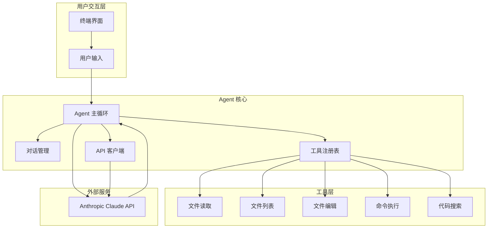
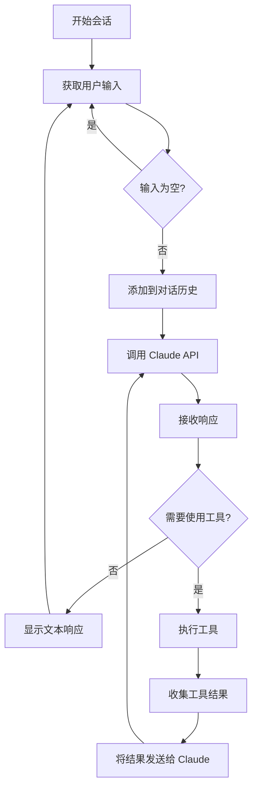
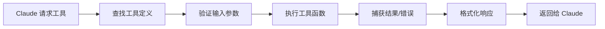

# 项目概览

## 简介

欢迎来到 AI 编程助手工作坊！本项目是一个循序渐进的学习项目，通过 Go 语言帮助你从零开始构建一个功能完整的 **AI 驱动的编程助手**。

你不需要成为 AI 专家。只需跟随教程，一步一步地构建，就能掌握如何创建智能编程助手的核心技能。

🌐 **想了解更多背景？** 查看博客文章：[ghuntley.com/agent](https://ghuntley.com/agent/)

## 项目目标

本项目旨在帮助你：

- 🎯 **理解 AI Agent 架构**：学习事件循环、工具系统和 API 集成的核心概念
- 🛠️ **掌握实用技能**：从基础聊天到文件操作、命令执行、代码搜索
- 📚 **循序渐进学习**：通过 6 个递进的步骤，逐步增加功能复杂度
- 💡 **实践驱动**：每个步骤都有可运行的代码和实际示例
- 🚀 **构建真实工具**：最终得到一个功能完整的本地开发助手

## 技术栈

### 核心技术

- **编程语言**：Go 1.24.2+
  - 简洁、高效、并发支持良好
  - 强类型系统确保代码可靠性
  - 丰富的标准库支持文件和系统操作

- **AI 模型**：Anthropic Claude 3.7 Sonnet
  - 强大的自然语言理解能力
  - 支持工具调用（Tool Use）
  - 长上下文窗口，适合代码分析

- **API 集成**：Anthropic SDK for Go
  - 官方 Go SDK，类型安全
  - 完整的消息和工具调用支持
  - 简洁的 API 设计

### 开发环境

- **devenv**（推荐）：基于 Nix 的可复现开发环境
  - 自动配置所有依赖
  - 跨平台一致性
  - 包含 Go、Node.js、Python、Rust、.NET 等工具链

- **手动配置**：支持传统的 Go 开发环境
  - 只需 Go 1.24.2+ 和 API 密钥
  - 使用 `go mod` 管理依赖

### 工具和库

- **ripgrep**：高性能代码搜索工具
- **jsonschema**：自动生成工具参数的 JSON Schema
- **标准库**：文件操作、命令执行、JSON 处理

## 学习收益

完成本工作坊后，你将能够：

### 1. 理解 AI Agent 架构

- ✅ 掌握事件循环（Event Loop）的工作原理
- ✅ 理解用户输入、API 调用、工具执行的完整流程
- ✅ 学会如何设计可扩展的 Agent 架构

### 2. 实现工具系统

- ✅ 定义工具接口和参数 Schema
- ✅ 注册和管理多个工具
- ✅ 处理工具调用和结果返回
- ✅ 实现错误处理和日志记录

### 3. 集成 Claude API

- ✅ 使用 Anthropic SDK 进行 API 调用
- ✅ 构建和管理对话历史
- ✅ 处理流式响应和工具请求
- ✅ 优化 token 使用和性能

### 4. 构建实用功能

- ✅ 文件读取和编辑
- ✅ 目录遍历和文件列表
- ✅ Shell 命令执行
- ✅ 代码模式搜索

### 5. 扩展和定制

- ✅ 创建自定义工具
- ✅ 实现工具链（多工具协作）
- ✅ 添加记忆功能
- ✅ 集成其他 AI 模型

## 系统架构

### 整体架构图



### 事件循环流程



### 工具执行流程



## 功能特性

### 渐进式功能构建

本项目通过 6 个版本逐步增加功能：

| 版本 | 文件 | 新增功能 | 学习重点 |
|------|------|----------|----------|
| **1** | `chat.go` | 基础聊天 | API 集成、消息处理 |
| **2** | `read.go` | 文件读取 | 工具系统、Schema 生成 |
| **3** | `list_files.go` | 目录列表 | 多工具管理、文件系统 |
| **4** | `bash_tool.go` | 命令执行 | Shell 集成、安全考虑 |
| **5** | `edit_tool.go` | 文件编辑 | 文件修改、字符串替换 |
| **6** | `code_search_tool.go` | 代码搜索 | ripgrep 集成、模式匹配 |

### 核心功能详解

#### 1. 基础聊天（chat.go）

- 与 Claude 进行自然语言对话
- 维护完整的对话历史
- 支持多轮交互
- 彩色终端输出

#### 2. 文件读取（read.go）

- 读取本地文件内容
- 自动处理文件编码
- 错误处理和日志记录
- 首次引入工具系统

#### 3. 目录列表（list_files.go）

- 递归遍历目录结构
- 列出文件和子目录
- 显示文件大小和数量
- 管理多个工具

#### 4. 命令执行（bash_tool.go）

- 执行 Shell 命令
- 捕获标准输出和错误
- 安全的命令执行
- 实时输出显示

#### 5. 文件编辑（edit_tool.go）

- 创建新文件
- 修改现有文件
- 字符串查找和替换
- 文件备份和恢复

#### 6. 代码搜索（code_search_tool.go）

- 使用 ripgrep 进行快速搜索
- 支持正则表达式
- 文件类型过滤
- 上下文行显示

## 项目结构

```
.
├── chat.go                 # 步骤1：基础聊天
├── read.go                 # 步骤2：文件读取
├── list_files.go           # 步骤3：目录列表
├── bash_tool.go            # 步骤4：命令执行
├── edit_tool.go            # 步骤5：文件编辑
├── code_search_tool.go     # 步骤6：代码搜索
├── go.mod                  # Go 模块定义
├── go.sum                  # 依赖锁定文件
├── devenv.nix              # devenv 配置
├── devenv.yaml             # devenv 设置
├── README.md               # 英文文档
├── AGENT.md                # 开发环境说明
├── docs/                   # 中文文档目录
│   ├── README.md           # 文档索引
│   ├── getting-started/    # 入门指南
│   ├── architecture/       # 架构设计
│   ├── workshop/           # 工作坊教程
│   ├── api-reference/      # API 参考
│   ├── guides/             # 开发指南
│   └── troubleshooting/    # 故障排查
└── prompts/                # 示例提示词
```

## 设计理念

### 1. 循序渐进

每个步骤都在前一步的基础上增加新功能，确保学习曲线平滑。你可以：

- 从最简单的聊天开始
- 逐步理解工具系统
- 最终构建完整的 Agent

### 2. 实践优先

所有代码都是可运行的，每个步骤都有：

- 完整的示例代码
- 实际的使用场景
- 详细的代码注释
- 测试和验证方法

### 3. 可扩展性

项目架构设计考虑了扩展性：

- 工具系统易于添加新工具
- Agent 结构支持自定义
- 清晰的接口定义
- 模块化的代码组织

### 4. 生产就绪

虽然是教学项目，但代码质量达到生产标准：

- 完善的错误处理
- 详细的日志记录
- 类型安全的设计
- 性能优化考虑

## 适用人群

本项目适合：

- ✅ **Go 开发者**：想要学习 AI 集成的 Go 程序员
- ✅ **AI 爱好者**：对构建 AI Agent 感兴趣的开发者
- ✅ **学习者**：希望通过实践项目学习新技术
- ✅ **工具开发者**：想要构建自己的开发工具
- ✅ **技术探索者**：对 LLM 应用开发感兴趣的人

### 前置知识要求

- **必需**：
  - 基础的 Go 语言知识（变量、函数、结构体）
  - 命令行使用经验
  - 基本的编程概念

- **推荐**：
  - 了解 REST API 的基本概念
  - 熟悉 JSON 数据格式
  - 有过文件系统操作经验

- **不需要**：
  - AI 或机器学习背景
  - 深度学习知识
  - 复杂的算法理解

## 下一步

准备好开始了吗？请按照以下顺序继续：

1. **[前置要求](prerequisites.md)** - 检查你的开发环境
2. **[安装配置](installation.md)** - 设置项目和 API 密钥（即将推出）
3. **[快速开始](quick-start.md)** - 运行你的第一个 Agent（即将推出）
4. **[工作坊教程](../workshop/)** - 深入学习每个步骤

如果你已经熟悉项目，可以直接跳转到：

- **[架构设计](../architecture/overview.md)** - 深入理解系统设计
- **[API 参考](../api-reference/)** - 查看详细的 API 文档（部分即将推出）
- **[开发指南](../guides/)** - 学习如何扩展和定制

---

**提示**：建议按照顺序学习，每个步骤都会为下一步打下基础。如果遇到问题，请查看 [故障排查](../troubleshooting/) 部分。
